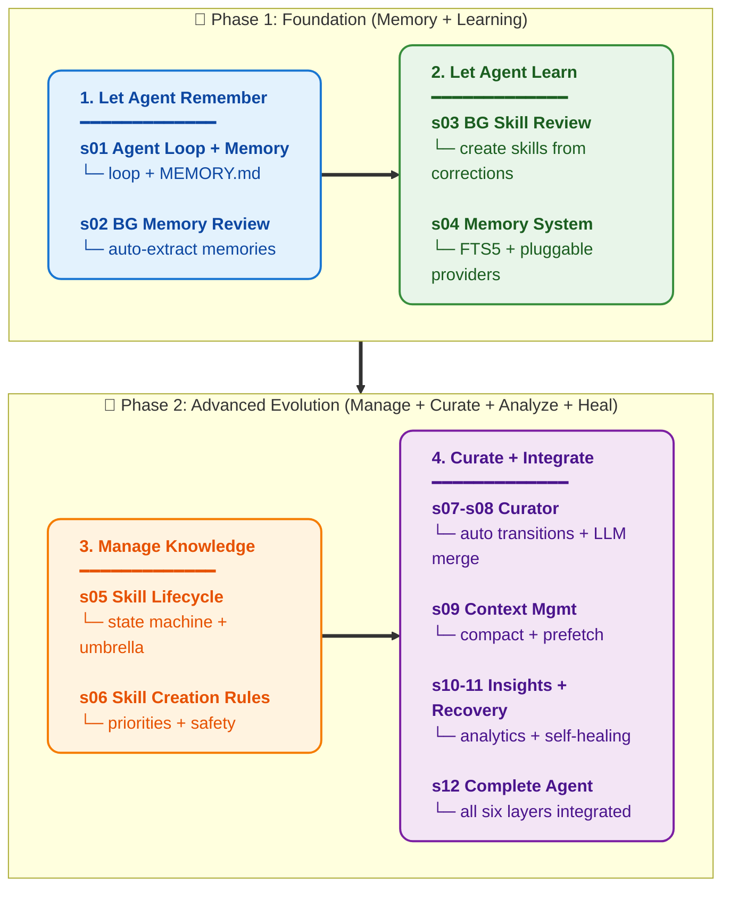

# Learn Hermes Agent — Self-Evolving Agent Harness Engineering

[中文](README.md) · [English](README.en.md)

<p align="center">
  
</p>

<p align="center">
  <a href="https://github.com/Ericcc-Ma/learn-hermes-agent/actions"></a>
  <a href="https://github.com/Ericcc-Ma/learn-hermes-agent/blob/main/LICENSE"></a>
  <a href="#"></a>
  <a href="#"></a>
  <a href="#"></a>
</p>

## Agency Comes from the Model. Self-Evolution Comes from the Harness.

An agent that perceives, reasons, and acts — that comes from model training. But an agent that **learns from every conversation, automatically distills knowledge, and improves itself over time** — that comes from the harness.

`learn-claude-code` taught you how to build the vehicle — the environment where an agent can act. This repository teaches you to build **a vehicle that evolves itself** — an agent that automatically accumulates knowledge during operation, creates skills, organizes its skill library, and gets smarter with every use.

> Rebuild the self-learning system behind Hermes Agent: make an agent remember you, learn from you, and improve with use.

## 30-Second Demo

Start with the self-evolution loop chapter:

```sh
python s12_comprehensive/comprehensive.py
```

Try: `Stop using camelCase in Python files — I always use snake_case.` Continue a few turns, run `/insights` and `/curator`.

For the full Hermes feature set (gateway, cron, profiles, teams, MCP):

```sh
python s18_full_hermes/full_hermes.py
```

---

## What is a Self-Evolving Agent?

A regular agent starts from zero every session. Close and reopen — it remembers nothing. Mistakes you corrected last time? It makes them again. Good solutions you discovered? Lost forever.

A self-evolving agent is different:

```
Every conversation → Background Review → Extract memories/skills → Persist
                                                ↓
Next conversation → Load memories → Match skills → Agent is smarter
                     ↓
            Periodic Curator → Skill library stays clean
```

**Core idea**: Conversations aren't just about completing tasks — they're learning opportunities. Every lesson learned, every preference expressed, every pattern discovered is automatically converted into reusable knowledge assets.

---

## Hermes Self-Evolution Architecture: Six Layers

Hermes is the self-evolution subsystem. Its architecture has six layers:

```
Layer 1: Real-time Learning    — Background Review
Layer 2: Skill Management      — Skill Lifecycle
Layer 3: Long-term Maintenance — Curator System
Layer 4: Memory System         — Persistent Knowledge
Layer 5: Context Management    — Compression & Injection
Layer 6: Data Analytics        — Insights Engine
```

Each layer solves one problem. Each layer builds on the previous one.

---

## Supported LLM Providers

All chapters use a unified `llm.py` module. Switch providers by setting `LLM_PROVIDER`:

| Provider | Example Models | Env Vars |
|----------|---------------|----------|
| **Anthropic** | claude-sonnet-4-6, claude-opus-4-8 | `ANTHROPIC_API_KEY` |
| **DeepSeek** | deepseek-chat, deepseek-reasoner | `DEEPSEEK_API_KEY` |
| **OpenAI** | gpt-4o, gpt-4o-mini | `OPENAI_API_KEY` |
| **Qwen / Tongyi** | qwen-plus, qwen-max | `LLM_API_KEY` + `LLM_BASE_URL` |
| **GLM / Zhipu** | glm-4-flash, glm-4-plus | `LLM_API_KEY` + `LLM_BASE_URL` |
| **Moonshot** | moonshot-v1-8k | `LLM_API_KEY` + `LLM_BASE_URL` |
| **Ollama (local)** | llama3, qwen2.5, etc. | `LLM_BASE_URL` |

```bash
# Use DeepSeek
LLM_PROVIDER=deepseek DEEPSEEK_API_KEY=sk-... MODEL_ID=deepseek-chat python s01_agent_loop/agent_loop.py

# Use Qwen
LLM_PROVIDER=openai_compat LLM_BASE_URL=https://dashscope.aliyuncs.com/compatible-mode/v1 LLM_API_KEY=sk-... python s01_agent_loop/agent_loop.py
```

Any OpenAI-compatible endpoint works via `LLM_PROVIDER=openai_compat` + custom `LLM_BASE_URL`.

---

## 24 Progressive Lessons

**Each lesson adds one self-evolution mechanism. Each mechanism has a motto.**

> **s01** &nbsp; *"One loop + one memory file = the simplest learning agent"* — Agent loop + MEMORY.md, remembering user preferences
>
> **s02** &nbsp; *"After every conversation, ask 'what did I learn?'"* — Background memory review, auto-extracting memories
>
> **s03** &nbsp; *"Good solutions aren't one-offs — distill them into skills"* — Background skill review, auto-creating skills from corrections
>
> **s04** &nbsp; *"Memory shouldn't be just one file"* — Dual-layer architecture, FTS5 search, pluggable providers
>
> **s05** &nbsp; *"Skills have a lifecycle"* — active → stale → archived, pin exemption, umbrella structure
>
> **s06** &nbsp; *"What to learn, what not to learn — rules exist"* — Signal priorities, forbidden capture list, safety guardrails
>
> **s07** &nbsp; *"30 days unused → mark stale, 90 days → archive, rules decide"* — Pure-rule auto state transitions, zero LLM cost
>
> **s08** &nbsp; *"Too many skills get messy — merge them periodically"* — LLM review & merging, prefix clustering, umbrella building
>
> **s09** &nbsp; *"Context fills up — compress it, but keep the important stuff out"* — Conversation compression, trajectory compression, memory prefetch
>
> **s10** &nbsp; *"You don't know how many tokens you're using? How can you optimize?"* — Token/cost tracking, tool usage patterns
>
> **s11** &nbsp; *"Errors aren't endpoints — they're learning starting points"* — Error detection, model fallback, self-healing
>
> **s12** &nbsp; *"Six layers in place, one self-evolving agent"* — All mechanisms integrated into one complete agent
>
> **s13** &nbsp; *"Set the time, agent wakes itself up"* — JSON file persistence + gateway ticker every 60s
>
> **s14** &nbsp; *"One gateway, all platforms"* — Multi-platform routing + delivery + session management
>
> **s15** &nbsp; *"One Hermes, many personas"* — Profile isolation + inheritance + per-profile gateway
>
> **s16** &nbsp; *"Too big? Delegate it"* — LLM-driven delegate_task + leaf/orchestrator role system
>
> **s17** &nbsp; *"Need more power? Plug in MCP"* — Multi-transport + unified tool pool + JSON-RPC
>
> **s18** &nbsp; *"All mechanisms, one Hermes"* — 18 features fully integrated
>
> **s19** &nbsp; *"Set boundaries first, then grant freedom"* — 4-level pipeline: DENY-ASK-SANDBOX-ALLOW
>
> **s20** &nbsp; *"Hook around the loop, never rewrite it"* — 8 extension points without touching the loop
>
> **s21** &nbsp; *"Each works in its own directory"* — git worktree isolation, zero-copy shared .git
>
> **s22** &nbsp; *"An agent without a plan drifts"* — Plan first, execute step by step, DAG dependencies
>
> **s23** &nbsp; *"Dispatcher assigns, workers execute"* — Kanban Dispatcher + claim TTL + failure protection
>
> **s24** &nbsp; *"Prompts are assembled, not hardcoded"* — Section-based composition + conditional injection

---

## Core Pattern

```python
def agent_loop(messages):
    while True:
        # 1. Pre-turn: inject relevant memories and skills
        inject_memories(messages)
        inject_skills(messages)

        response = client.messages.create(
            model=MODEL, system=build_system(),
            messages=messages, tools=TOOLS,
        )
        messages.append({"role": "assistant", "content": response.content})

        if response.stop_reason != "tool_use":
            # 2. Post-turn: background review, extract learning
            spawn_background_review(messages)
            return

        # 3. Execute tools
        results = execute_tools(response.content)
        messages.append({"role": "user", "content": results})
```

The loop never changes. Self-evolution mechanisms hang on before and after the loop. The model decides. The harness learns.

---

## All Chapters

| Chapter | Topic | Key Concepts |
|---|---|---|
| [s01](./s01_agent_loop/) | Agent Loop + Memory | `agent_loop` / `MEMORY.md` / persistence |
| [s02](./s02_background_memory_review/) | BG Memory Review | `BackgroundReview` / nudge / snapshot |
| [s03](./s03_background_skill_review/) | BG Skill Review | signal detection / auto-creation / priorities |
| [s04](./s04_memory_system/) | Memory System Deep Dive | FTS5 / pluggable providers / lifecycle hooks |
| [s05](./s05_skill_lifecycle/) | Skill Lifecycle | active/stale/archived / pin / umbrella |
| [s06](./s06_skill_creation/) | Skill Auto-Creation | signal priority / forbidden capture / safety |
| [s07](./s07_curator_state/) | Curator Auto Transitions | pure-rule state machine / idle trigger |
| [s08](./s08_curator_llm/) | Curator LLM Merge | prefix clustering / umbrella merge / reports |
| [s09](./s09_context_management/) | Context Management | compaction / trajectory / prefetch |
| [s10](./s10_insights/) | Insights Engine | token stats / cost analysis / patterns |
| [s11](./s11_error_recovery/) | Error Recovery | retry / fallback / self-healing |
| [s12](./s12_comprehensive/) | Complete Self-Evolving Agent | all six layers integrated |
| [s13](./s13_cron_scheduler/) | Cron Scheduler | scheduled tasks + gateway ticker |
| [s14](./s14_gateway/) | Gateway | multi-platform routing + delivery |
| [s15](./s15_profiles/) | Multi-Profile | config isolation + inheritance |
| [s16](./s16_agent_teams/) | Agent Teams | `delegate_task` tool + leaf/orchestrator roles |
| [s17](./s17_mcp_plugin/) | MCP Plugin | multi-transport + tool pool |
| [s18](./s18_full_hermes/) | Full Hermes | all features integrated |
| [s19](./s19_permission/) | Permission System | 4-level approval pipeline |
| [s20](./s20_hooks/) | Hook System | 8 extension points |
| [s21](./s21_worktree/) | Worktree Isolation | git worktree per-task isolation |
| [s22](./s22_planning/) | Planning System | TodoWrite + DAG dependencies |
| [s23](./s23_autonomous/) | Kanban Dispatcher | central dispatch + claim TTL + failure protection |
| [s24](./s24_system_prompt/) | System Prompt | section-based composition |

---

## Hermes Source Map

If you want to read from the teaching code back into production Hermes, start here:

- [Hermes Source Map](docs/hermes-source-map.md) — how the 24 lessons map to the core files in Hermes Agent
- [FAQ](docs/faq.md) — positioning, reading order, API keys, and why the teaching version simplifies production mechanisms

Shortest path: run any chapter script, then use the source map to read the corresponding production file.

---

## Learning Path

Main line: remember → learn → manage knowledge → curate → analyze → self-heal → complete evolution



---

## How to Read

Each chapter is a self-contained folder:

```
s04_memory_system/
  README.md              # Complete narrative + inline code + Deep Dive
  README.en.md           # English translation (select chapters)
  memory_system.py       # Standalone runnable implementation
  images/                # SVG architecture diagrams
```

Read from s01 through s24 in order. Each chapter assumes prior chapters and ends with a hook to the next. The `<details>` fold at the end of each README maps teaching code to production Hermes source files.

---

## Quick Start

```sh
git clone <learn-hermes-agent-repo>
cd learn-hermes-agent
pip install -r requirements.txt
cp .env.example .env   # Edit: choose LLM_PROVIDER and fill API key

# Use Anthropic (default)
python s01_agent_loop/agent_loop.py

# Use DeepSeek
LLM_PROVIDER=deepseek DEEPSEEK_API_KEY=sk-... MODEL_ID=deepseek-chat python s01_agent_loop/agent_loop.py

# Use Qwen
LLM_PROVIDER=openai_compat LLM_BASE_URL=https://dashscope.aliyuncs.com/compatible-mode/v1 LLM_API_KEY=sk-... python s01_agent_loop/agent_loop.py
```

---

## Relationship with learn-claude-code

`learn-claude-code` teaches harness fundamentals — loops, tools, permissions, sub-agents, task systems. This repository assumes you understand those basics and focuses on the **self-evolution layer**.

```
learn-claude-code                   learn-hermes-agent
(agent harness basics:              (self-evolving harness:
 loop, tools, permissions,           background review, skill lifecycle,
 sub-agents, task system,            curator, memory system, insights)
 worktree isolation)
```

The two repositories are complementary. Together they cover the full harness engineering spectrum from "can act" to "can evolve."

---

## Project Structure

```
learn-hermes-agent/
  llm.py                        # Unified LLM adapter (Anthropic/DeepSeek/OpenAI/...)
  requirements.txt              # Python dependencies
  .github/workflows/test.yml    # CI (168 tests)
├── Self-Evolution Core (s01-s12)
│   s01_agent_loop/             # Agent Loop + Basic Memory
│   s02_background_memory_review/# Background Memory Review (Nudge)
│   s03_background_skill_review/ # Background Skill Review (Signals)
│   s04_memory_system/          # FTS5 + Pluggable Memory Providers
│   s05_skill_lifecycle/        # active/stale/archived State Machine
│   s06_skill_creation/         # Signal Priority + Forbidden Capture
│   s07_curator_state/          # Curator P1: Pure-Rule Auto Transitions
│   s08_curator_llm/            # Curator P2: LLM Review & Merge
│   s09_context_management/     # Conversation Compression + Prefetch
│   s10_insights/               # Token/Cost/Tool Analytics
│   s11_error_recovery/         # Retry + Fallback + Self-Healing
│   s12_comprehensive/          # Six-Layer Self-Evolution Integration
├── Advanced Features (s13-s18)
│   s13_cron_scheduler/         # Scheduled Tasks + Gateway Ticker
│   s14_gateway/                # Multi-Platform Message Gateway
│   s15_profiles/               # Multi-Profile Isolation + Inheritance
│   s16_agent_teams/            # delegate_task + leaf/orchestrator
│   s17_mcp_plugin/             # MCP External Tool Integration
│   s18_full_hermes/            # Full Hermes Integration
├── Harness Foundations (s19-s24)
│   s19_permission/             # 4-Level Approval Pipeline
│   s20_hooks/                  # 8 Hook Extension Points
│   s21_worktree/               # Git Worktree Per-Task Isolation
│   s22_planning/               # TodoWrite + Dependency DAG
│   s23_autonomous/             # Kanban Dispatcher + Claim TTL
│   s24_system_prompt/          # Section-Based Composition
├── assets/                     # Social Preview Image
├── scripts/                    # Utility Scripts
├── tests/                      # 168 Automated Tests
└── web/                        # Next.js Learning Platform
```

---

## License

MIT

---

**Agency comes from the model. Self-evolution comes from the harness. Every conversation is a learning opportunity. Knowledge learned is automatically distilled into reusable skills and memories.**

**Build the harness that learns. The model will do the rest.**
