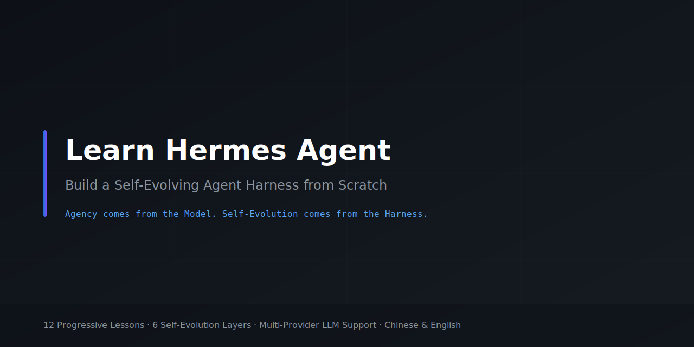
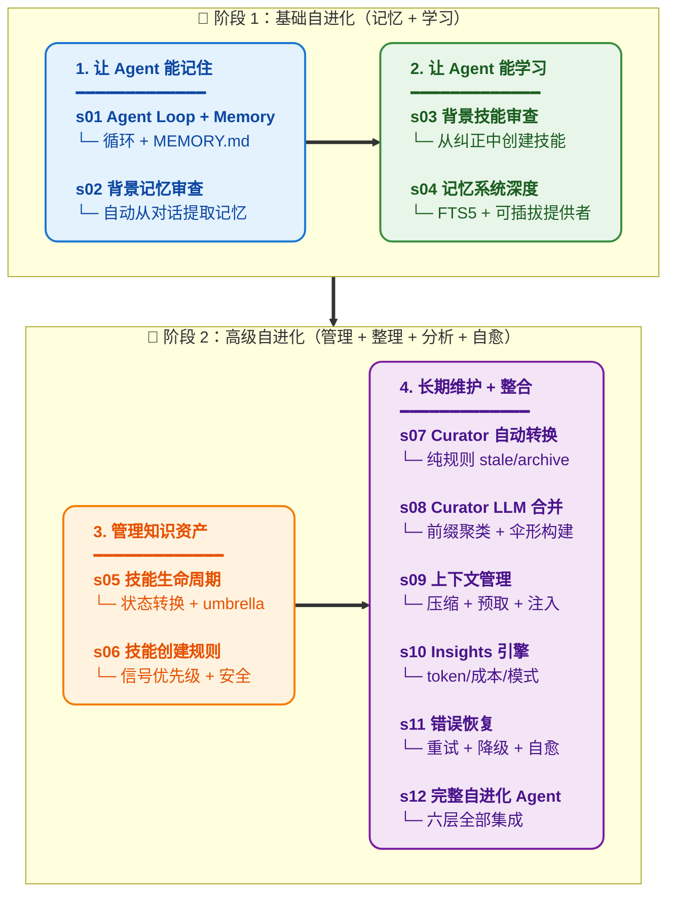

# Learn Hermes Agent -- 自进化 Agent Harness 工程

[中文](README.md) · [English](README.en.md)

<p align="center">
  
</p>

<p align="center">
  <a href="https://github.com/Ericcc-Ma/learn-hermes-agent/actions"></a>
  <a href="https://github.com/Ericcc-Ma/learn-hermes-agent/blob/main/LICENSE"></a>
  <a href="#"></a>
  <a href="#"></a>
  <a href="#"></a>
</p>

## Agency 来自模型。自进化来自 Harness。

一个 agent 能感知、推理、行动，这是模型训练出来的。但一个 agent 能**从每次对话中学习、自动沉淀知识、长期自我改进**——这是 harness 赋予的。

`learn-claude-code` 教了你如何造载具——让 agent 能动手的环境。本仓库教你造**会自己进化的载具**——让 agent 在运行中自动积累知识、创建技能、整理技能库、最终越用越聪明。

> 从零复刻 Hermes Agent 的自学习系统：让 Agent 记住你、学习你、越用越聪明。

## 30 秒 Demo

建议先跑自进化闭环章节，直接观察效果：

```sh
python s12_comprehensive/comprehensive.py
```

试这条输入：

```text
Stop using camelCase in Python files — I always use snake_case.
```

继续交互几轮，运行 `/insights` 和 `/curator`。你会看到纠正被沉淀为记忆/技能。

想体验完整 Hermes 特性（gateway、cron、profiles、teams、MCP）：

```sh
python s18_full_hermes/full_hermes.py   # 完整集成 + 架构图 + 指标面板
```

---

## 什么是自进化 Agent

普通 agent 每次对话从零开始。关了重开，什么都不记得。用户纠正过的错误下次照样犯。发现的好方案下次照样找不到。

自进化 agent 不同：

```
每次对话 → 背景审查 → 提取记忆/技能 → 持久化
                                            ↓
下次对话 → 加载记忆 → 匹配技能 → Agent 更聪明了
                     ↓
               定期整理（Curator）→ 技能库不膨胀
```

**核心思想**：对话不只是完成任务，更是学习机会。学到的每一个教训、每一条偏好、每一种模式，都自动转化为可复用的知识资产。

---

## Hermes 自进化体系：六层架构

Hermes 是 Claude Code 的自进化子系统。它的架构分为六个层次：

```
第 1 层：实时学习    — Background Review（背景审查）
第 2 层：技能管理    — Skill Lifecycle（生命周期）
第 3 层：长期维护    — Curator System（技能库整理）
第 4 层：记忆系统    — Memory System（持久化知识）
第 5 层：上下文管理  — Context Management（压缩与注入）
第 6 层：数据分析    — Insights Engine（使用分析）
```

每一层解决一个问题，每一层在前一层的基础上叠加。

---

## 24 个递进课程

**每个课程添加一个自进化机制。每个机制有一句格言。**

> **s01** &nbsp; *"一个循环 + 一个记忆文件 = 最简单的学习 agent"* — 在 agent loop 上加 MEMORY.md，记住用户偏好
>
> **s02** &nbsp; *"每次对话结束，问自己'学到了什么'"* — 背景记忆审查，自动从对话中提取记忆
>
> **s03** &nbsp; *"好方案不只用一次，沉淀为技能"* — 背景技能审查，从纠正和发现中自动创建技能
>
> **s04** &nbsp; *"记忆不该只有一个文件"* — 双层架构、可插拔提供者、FTS5 全文搜索
>
> **s05** &nbsp; *"技能有生老病死"* — active → stale → archived 生命周期，pin 豁免，Umbrella 结构
>
> **s06** &nbsp; *"什么该学、什么不该学——有规则"* — 信号优先级、禁止捕获列表、安全护栏
>
> **s07** &nbsp; *"30 天不用就标记，90 天归档，规则说了算"* — 纯规则自动状态转换，零 LLM 成本
>
> **s08** &nbsp; *"技能太多会乱，定期合并整理"* — LLM 审查合并，前缀聚类，伞形构建
>
> **s09** &nbsp; *"上下文满了就压，但重要的事要留在外面"* — 对话压缩、轨迹压缩、记忆预取
>
> **s10** &nbsp; *"你不知道自己用了多少 token？那怎么优化"* — Token/成本追踪、工具模式分析
>
> **s11** &nbsp; *"出错了不是终点，是学习的起点"* — 错误检测、模型降级、自愈策略
>
> **s12** &nbsp; *"六层归位，一个会自己进化的 agent"* — 全部机制回到一个完整自进化 agent
>
> **s13** &nbsp; *"定好时间，agent 自己醒来干活"* — JSON 文件落盘 + gateway ticker 每 60s 调度
>
> **s14** &nbsp; *"一个 gateway，连接所有平台"* — 多平台消息路由 + delivery 分发 + session 管理
>
> **s15** &nbsp; *"一套 Hermes，多个人设"* — 独立 profile 隔离模型、技能、平台，支持继承
>
> **s16** &nbsp; *"一个搞不定，delegate 出去"* — LLM 自主调用 delegate_task spawn 子 agent，leaf/orchestrator 角色系统
>
> **s17** &nbsp; *"能力不够？接上 MCP"* — 多传输 + 工具池统一 + JSON-RPC
>
> **s18** &nbsp; *"全部机制，一个完整 Hermes"* — 18 章特性完整集成
>
> **s19** &nbsp; *"先划边界，再给自由"* — 四层权限管线：DENY → ASK → SANDBOX → ALLOW
>
> **s20** &nbsp; *"挂在循环上，不写进循环里"* — 8 个 hook 扩展点，不改循环代码即可扩展
>
> **s21** &nbsp; *"各干各的目录，互不干扰"* — git worktree 并行隔离，零拷贝共享 .git
>
> **s22** &nbsp; *"没计划的 agent 走哪算哪"* — 先列计划再执行，任务依赖 DAG + 状态追踪
>
> **s23** &nbsp; *"不是 worker 自己扫板，是 Dispatcher 中心分配"* — Kanban Dispatcher + claim TTL + 失败保护
>
> **s24** &nbsp; *"prompt 是拼出来的，不是写死的"* — 分段定义 + 条件注入 + 运行时组装

---

## 核心模式

```python
def agent_loop(messages):
    while True:
        # 1. 每轮前：注入相关记忆和技能
        inject_memories(messages)
        inject_skills(messages)

        response = client.messages.create(
            model=MODEL, system=build_system(),
            messages=messages, tools=TOOLS,
        )
        messages.append({"role": "assistant", "content": response.content})

        if response.stop_reason != "tool_use":
            # 2. 每轮后：背景审查，提取学习
            spawn_background_review(messages)
            return

        # 3. 执行工具
        results = execute_tools(response.content)
        messages.append({"role": "user", "content": results})
```

循环不变。自进化机制挂在循环的前后。模型负责决策，harness 负责学习。

---

## 全部章节

| 章节 | 主题 | 关键概念 |
|---|---|---|
| [s01](./s01_agent_loop/) | Agent Loop + Memory | `agent_loop` / `MEMORY.md` / 记忆持久化 |
| [s02](./s02_background_memory_review/) | 背景记忆审查 | `BackgroundReview` / nudge / 对话快照 |
| [s03](./s03_background_skill_review/) | 背景技能审查 | 信号检测 / 技能自动创建 / 优先级规则 |
| [s04](./s04_memory_system/) | 记忆系统深度 | FTS5 / 可插拔提供者 / 生命周期钩子 |
| [s05](./s05_skill_lifecycle/) | 技能生命周期 | active/stale/archived / pin / Umbrella 结构 |
| [s06](./s06_skill_creation/) | 技能自动创建 | 信号优先级 / 禁止捕获 / 操作优先级 |
| [s07](./s07_curator_state/) | Curator 自动转换 | 纯规则状态机 / 空闲触发 / 配置管理 |
| [s08](./s08_curator_llm/) | Curator LLM 合并 | 前缀聚类 / 伞形合并 / 降级 / 报告生成 |
| [s09](./s09_context_management/) | 上下文管理 | 对话压缩 / 轨迹压缩 / 记忆预取 / 注入格式 |
| [s10](./s10_insights/) | Insights 引擎 | Token 统计 / 成本分析 / 工具模式 / 趋势 |
| [s11](./s11_error_recovery/) | 错误恢复 | 重试策略 / fallback 模型 / 自愈流程 |
| [s12](./s12_comprehensive/) | 完整自进化 Agent | 六层架构完整集成 |
| [s13](./s13_cron_scheduler/) | Cron Scheduler | 定时任务 + gateway ticker + 持久化 |
| [s14](./s14_gateway/) | Gateway | 多平台消息路由 + delivery 分发 |
| [s15](./s15_profiles/) | Multi-Profile | 配置隔离 + 继承链 + 独立 gateway |
| [s16](./s16_agent_teams/) | Agent Teams | delegate_task 工具 + leaf/orchestrator 角色 |
| [s17](./s17_mcp_plugin/) | MCP Plugin | 多传输 + 工具池组装 + JSON-RPC |
| [s18](./s18_full_hermes/) | Full Hermes | 全部特性集成 |
| [s19](./s19_permission/) | Permission System | 四层审批管线 |
| [s20](./s20_hooks/) | Hook System | 8 个扩展点 |
| [s21](./s21_worktree/) | Worktree Isolation | git worktree 并行隔离 |
| [s22](./s22_planning/) | Planning System | TodoWrite + 依赖 DAG |
| [s23](./s23_autonomous/) | Kanban Dispatcher | 中心调度 + claim TTL + 失败保护 |
| [s24](./s24_system_prompt/) | System Prompt | 分段 + 条件拼接 |

---

## Hermes 源码地图

如果你想从教学代码读回生产源码，看这份导航：

- [Hermes 源码地图](docs/hermes-source-map.md) — 24 章教程与 Hermes Agent 核心文件的对应关系
- [FAQ](docs/faq.md) — 项目定位、学习顺序、API Key、教学版简化原因

最短路径：先跑 `s12_comprehensive/comprehensive.py` 看完整效果，再按源码地图读 `run_agent.py`、`agent/background_review.py`、`agent/curator.py`、`agent/memory_manager.py`。

---

## 学习路径

主线：能记住 → 能学习 → 能管理知识 → 能整理 → 能分析 → 能自愈 → 完整进化



---

## 如何阅读

每章一个独立文件夹，包含完整叙事文档和可运行代码：

```
s04_memory_system/
  README.md              # 完整叙事 + 原理讲解 + 内联代码
  README.en.md           # 英文翻译（部分章节）
  memory_system.py       # 独立可运行实现
  images/                # SVG 架构图
```

按顺序从 s01 读到 s24。每章假定你已读过前面章节，章末有通往下一章的钩子。每个 README 末尾有 `<details>` 折叠区引用 Hermes 生产源码。

---

## 快速开始

```sh
git clone <learn-hermes-agent-repo>
cd learn-hermes-agent
pip install -r requirements.txt
cp .env.example .env   # 编辑 .env 选择 LLM_PROVIDER 并填入 API Key

# 使用 Anthropic（默认）
python s01_agent_loop/agent_loop.py

# 使用 DeepSeek
LLM_PROVIDER=deepseek DEEPSEEK_API_KEY=sk-... MODEL_ID=deepseek-chat python s01_agent_loop/agent_loop.py

# 使用通义千问
LLM_PROVIDER=openai_compat LLM_BASE_URL=https://dashscope.aliyuncs.com/compatible-mode/v1 LLM_API_KEY=sk-... python s01_agent_loop/agent_loop.py
```

---

## 支持的语言模型

通过统一的 `llm.py` 模块，支持多种 LLM provider。设置 `LLM_PROVIDER` 环境变量即可切换：

| Provider | 模型示例 | 环境变量 |
|----------|---------|---------|
| **Anthropic** | claude-sonnet-4-6, claude-opus-4-8 | `ANTHROPIC_API_KEY` |
| **DeepSeek** | deepseek-chat, deepseek-reasoner | `DEEPSEEK_API_KEY` |
| **OpenAI** | gpt-4o, gpt-4o-mini | `OPENAI_API_KEY` |
| **通义千问 / Qwen** | qwen-plus, qwen-max | `LLM_API_KEY` + `LLM_BASE_URL` |
| **智谱 / GLM** | glm-4-flash, glm-4-plus | `LLM_API_KEY` + `LLM_BASE_URL` |
| **月之暗面 / Moonshot** | moonshot-v1-8k | `LLM_API_KEY` + `LLM_BASE_URL` |
| **Ollama (本地)** | llama3, qwen2.5, etc. | `LLM_BASE_URL` |

```bash
# 使用 DeepSeek
LLM_PROVIDER=deepseek DEEPSEEK_API_KEY=sk-... MODEL_ID=deepseek-chat python s01_agent_loop/agent_loop.py

# 使用通义千问
LLM_PROVIDER=openai_compat LLM_BASE_URL=https://dashscope.aliyuncs.com/compatible-mode/v1 LLM_API_KEY=sk-... MODEL_ID=qwen-plus python s01_agent_loop/agent_loop.py
```

所有 provider 通过 `LLM_PROVIDER=openai_compat` + 自设 `LLM_BASE_URL` 即可接入任意 OpenAI 兼容接口。

---

## 与 learn-claude-code 的关系

`learn-claude-code` 教 harness 基础——循环、工具、权限、子 agent、任务系统等让 agent 能"动手"的机制。本仓库假定你已理解这些基础，专注于**自进化层**——让 agent 越用越聪明的机制。

```
learn-claude-code                   learn-hermes-agent
(agent harness 基础:                 (自进化 harness:
 循环、工具、权限、子 agent、          背景审查、技能生命周期、
 任务系统、worktree 隔离)             Curator、记忆系统、Insights)
```

两仓库互补。合在一起，覆盖了从"能动手"到"会进化"的完整 harness 工程。

---

## 项目结构

```
learn-hermes-agent/
  llm.py                        # 统一 LLM 适配 (Anthropic/DeepSeek/OpenAI/...)
  requirements.txt              # Python 依赖
  .github/workflows/test.yml    # CI (168 tests)
├── 自进化核心 (s01-s12)
│   s01_agent_loop/             # Agent Loop + 基础记忆
│   s02_background_memory_review/# 背景记忆审查 (Nudge)
│   s03_background_skill_review/ # 背景技能审查 (信号检测)
│   s04_memory_system/          # FTS5 + 可插拔记忆提供者
│   s05_skill_lifecycle/        # active/stale/archived 状态机
│   s06_skill_creation/         # 信号优先级 + 禁止捕获
│   s07_curator_state/          # Curator P1: 纯规则自动转换
│   s08_curator_llm/            # Curator P2: LLM 审查合并
│   s09_context_management/     # 对话压缩 + 记忆预取
│   s10_insights/               # Token/成本/工具分析
│   s11_error_recovery/         # 重试 + 降级 + 自愈
│   s12_comprehensive/          # 六层自进化集成
├── 高级特性 (s13-s18)
│   s13_cron_scheduler/         # 定时任务 + gateway ticker
│   s14_gateway/                # 多平台消息网关
│   s15_profiles/               # 多 profile 隔离 + 继承
│   s16_agent_teams/            # 子 agent + JSONL 邮箱
│   s17_mcp_plugin/             # MCP 外部工具接入
│   s18_full_hermes/            # 完整 Hermes 集成
├── Harness 基础 (s19-s24)
│   s19_permission/             # 四层审批管线
│   s20_hooks/                  # 8 个 Hook 扩展点
│   s21_worktree/               # git worktree 并行隔离
│   s22_planning/               # TodoWrite + 依赖 DAG
│   s23_autonomous/             # 空闲循环 + 自主认领
│   s24_system_prompt/          # 分段拼接 + 条件注入
├── assets/                     # 社交预览图
├── scripts/                    # 工具脚本
├── tests/                      # 168 个自动化测试
└── web/                        # Next.js 教学平台
```

---

## 许可证

MIT

---

**Agency 来自模型。自进化来自 Harness。每次对话都是学习机会，学到的知识自动沉淀为可复用的技能和记忆。**

**Build the harness that learns. The model will do the rest.**
