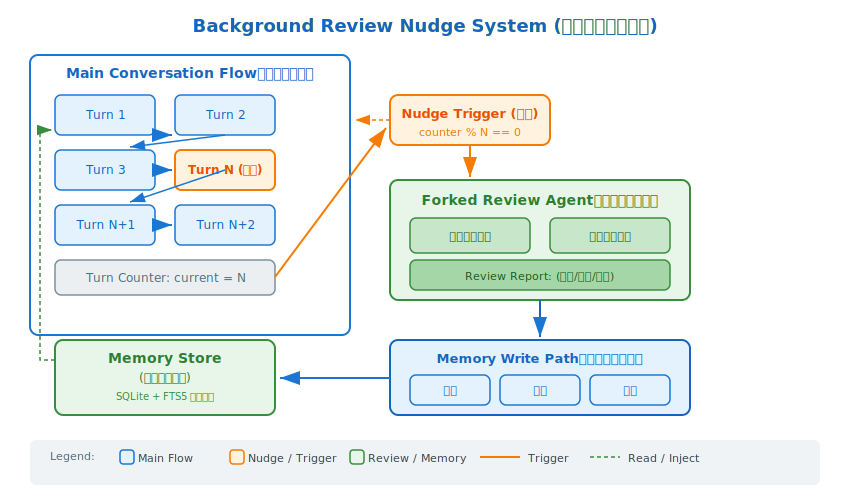

# s02: Background Review — 自动背景记忆审查

[中文](README.md) · [English](README.en.md)

s01 → `s02` → [s03](../s03_background_skill_review/) → s04 → ... → s12
> *"每次对话结束，问自己'学到了什么'"* — 后台 fork 独立 agent，自动审查每轮对话，提取记忆。
>
> **自进化层**: 实时学习（Background Review）— 自进化体系的最前线。

---

## 问题

s01 的记忆提取在对话完全结束后才运行。但真正的自进化 agent 需要更主动：

- 对话中用户说"别用 snake_case，用 camelCase"——这一刻就应该记住
- 用户纠正了 agent 的错误——这个教训不能等到对话结束
- 对话很长，等到最后可能已经有几十轮，提取质量会下降

**被动的记忆提取不够。需要主动的、周期性的审查。**

---

## 解决方案

**Nudge 系统**：每 N 轮对话后，后台 fork 一个独立的 AIAgent，回放对话快照，自我询问"是否有值得保存的记忆？"



```
对话继续 → 轮次计数
              ↓
        nudge 触发? (每 5 轮)
         /          \
       否            是
        ↓             ↓
     继续对话     fork 独立 agent
                     ↓
                 审查最近对话
                     ↓
              有新信息? → 写入 MEMORY.md
```

关键设计：
- **后台执行**：不阻塞主对话，不影响 prompt cache
- **独立 agent**：fork 出去，用独立的消息列表，不污染主对话
- **只读快照**：审查的是对话快照（副本），不修改主对话状态

---

## 工作原理

### Nudge 配置

```python
class Config:
    MEMORY_NUDGE_INTERVAL = 5  # 每 5 轮触发一次记忆审查

turn_count = 0

def agent_loop(query, client, messages=None):
    global turn_count
    # ... agent loop logic ...

    if response.stop_reason != "tool_use":
        turn_count += 1
        if turn_count % config.MEMORY_NUDGE_INTERVAL == 0:
            background_memory_review(messages)  # ← nudge 触发
        return response

    # 工具执行后也检查
    turn_count += 1
    if turn_count % config.MEMORY_NUDGE_INTERVAL == 0:
        background_memory_review(messages)
```

### 审查内容

```python
def background_memory_review(messages_snapshot):
    """后台记忆审查：fork 独立 AIAgent，回放对话快照"""

    dialogue = format_snapshot(messages_snapshot[-12:])

    review_prompt = f"""Review this conversation snapshot for:

1. User preferences (coding style, workflow, tools)
2. User feedback about agent behavior ("stop doing X")
3. Project-specific facts (architecture, constraints)
4. Reference information (URLs, dashboards, tickets)

Conversation:
{dialogue}

Return JSON array of memories or [] if nothing new."""

    # Fork 独立 agent
    response = CLIENT.messages.create(
        model=MODEL,
        messages=[{"role": "user", "content": review_prompt}],
        max_tokens=500,
    )
    # Parse and save memories
```

### 审查四维度

| 维度 | 审查内容 | 示例 |
|------|---------|------|
| 用户偏好 | 编码风格、工作流、工具偏好 | "用 tab 不用空格" |
| 用户反馈 | 对 agent 行为的纠正/期望 | "stop formatting my code" |
| 项目事实 | 架构决策、约束、目标 | "auth 模块正在重写" |
| 参考资料 | URL、看板、工单号 | "pipeline bug 在 LINEAR-1234" |

---

## 相对 s01 的变更

| 组件 | s01 | s02 |
|------|-----|-----|
| 记忆提取时机 | 对话完全结束后 | 每 N 轮自动触发 |
| 提取方式 | 被动等待 | 主动 nudge + fork |
| Nudge 系统 | 无 | 可配置的轮次计数 |
| 审查 agent | 共享主 agent | 独立 fork |
| 对主对话影响 | 阻塞 | 非阻塞（教学版简化为同步） |

---

## 试一下

```sh
python s02_background_memory_review/code.py
```

试试这些 prompt（注意观察 nudge 触发时机——每 5 轮）：

1. `Hello, I'm working on a React project`
2. `I prefer functional components over class components`
3. `What's the weather like?`（无学习价值的轮次）
4. `My project uses TypeScript strict mode`
5. `Can you list files in this directory?`（此时应触发 nudge）

观察重点：第 5 轮后是否出现 `[BackgroundReview]` 输出？提取的记忆是否准确？无关轮次是否被正确过滤？

---

## Nudge 系统设计原则

### 1. 频率权衡

太频繁 → 浪费 LLM 调用、打断用户体验
太稀少 → 遗漏重要信息

Hermes 默认 10 轮。教学版用 5 轮，方便观察。

### 2. 快照而非引用

审查 agent 拿到的是对话的**副本**（snapshot），不是主对话的引用。这样：
- fork 的 agent 修改不会影响主对话
- snapshot 可以被裁剪（只取最近 N 轮）
- 不会有不安全的引用竞争

### 3. 只写入不读取

审查 agent 只负责**写入**新记忆。读取记忆仍然在主 agent loop 的 `build_system()` 中完成。职责分离。

---

## 接下来

现在 agent 能自动从对话中提取记忆了。但记忆只是"用户是谁"。真正的自进化还需要技能——"怎么做这类任务"。而且最好的技能创建信号来自用户的纠正。

s03 Background Review: Skill Review → 从对话中自动检测技能创建信号，把好方案沉淀为可复用技能。

<details>
<summary>深入 Hermes 源码</summary>

本节对应 Hermes 生产源码中的以下文件：

- **`agent/background_review.py:34-43`** — 记忆审查的核心实现。生产版在此处 fork 一个独立的 `AIAgent` 实例（使用独立的消息列表，不污染主对话），向其注入审查 prompt，询问"对话中是否透露了用户偏好/个人信息/工作风格？用户是否表达了对 agent 行为方式的期望？"。审查结果通过 `memory` 工具自动写入 `MEMORY.md` / `USER.md`。
- **`agent/conversation_loop.py`** — nudge 触发逻辑。生产版的 nudge 计数器分两种：`memory.nudge_interval`（默认 10 轮触发一次记忆审查）和 `skills.creation_nudge_interval`（默认 10 次工具迭代触发一次技能审查）。在主对话循环的 post-turn hook 中检查计数器并决定是否 spawn 审查 agent。

**教学版简化了什么**：
- 生产版是真正的**后台异步**——fork 独立 agent 线程，不阻塞主对话，不影响 prompt cache；教学版是同步阻塞调用
- 生产版审查的是对话**快照副本**（`list(messages)`），fork agent 的修改不会影响主对话状态；教学版直接传递引用
- 生产版可以**裁剪快照**只取最近 N 轮减少 token 成本；教学版取最近 12 轮
- 生产版的审查结果直接调用 `memory` 工具写入，支持增删改查；教学版是简单的文件追加

</details>

<!-- translation-sync: zh@v1 -->
