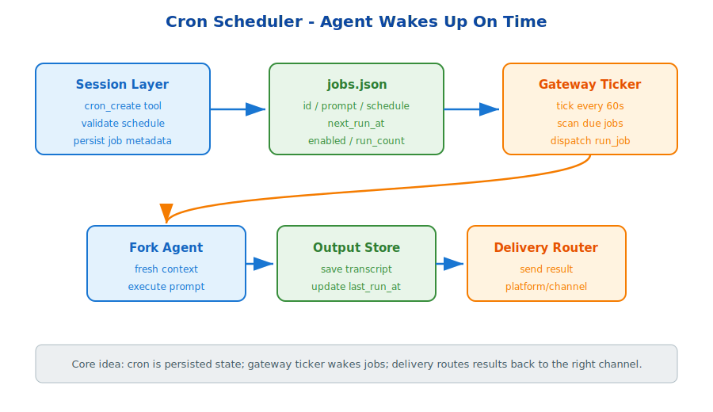

# s13: Cron Scheduler — Let The Agent Wake Up On Time

[中文](README.md) · [English](README.en.md)

s01 → ... → s12 → `s13` → [s14](../s14_gateway/) → ... → s18
> *"Set the time, and the agent wakes itself up"* — persisted JSON jobs + gateway ticker + delivery routing.
>
> **Hermes Feature**: Scheduled tasks — turns the agent from reactive chat into a system that can run work at the right time.

---

## Problem

The s01-s12 agent is reactive. A user sends a message, the agent responds. When the session is closed, nothing actively happens.

Real deployments need proactive triggers: summarize yesterday's work every morning, check service health hourly, or generate a weekly report on Monday.

**The agent needs scheduled tasks: it should wake up and run without a human pushing it.**

---

## Solution



The teaching version uses three layers:

1. **Creation layer**: the agent calls `cron_create`, validates the schedule, and writes the job to `~/.hermes/cron/jobs.json`.
2. **Scheduling layer**: the gateway ticker wakes up every 60 seconds and checks whether any job is due.
3. **Execution layer**: a due job forks an isolated agent, saves output, updates timestamps, and sends the result through delivery routing.

The important design choice is persistence. A cron job is not just an in-memory timer. It is durable state with `id`, `prompt`, `schedule`, `enabled`, `last_run_at`, and `next_run_at`.

---

## Core Mechanisms

### Job Persistence

Jobs are stored as JSON. Restarting the session or machine does not erase them.

### Gateway Ticker

The gateway owns the background ticker because it is the process that stays alive across platforms and can deliver results back to users.

### Delivery Routing

The job result is not printed blindly. It is routed back to the platform and channel where the job was created.

---

## Try It

```sh
python s13_cron_scheduler/cron_scheduler.py
```

Create a job, simulate time passing, and observe how due jobs are selected, executed, and marked with their next run time.

---

## What The Teaching Version Simplifies

- Production supports richer cron syntax and timezone handling.
- Production uses background gateway services instead of a foreground demo loop.
- Production can route results through encrypted adapters.
- Production can support no-agent jobs for pure script execution.

<!-- translation-sync: en@v1 -->
