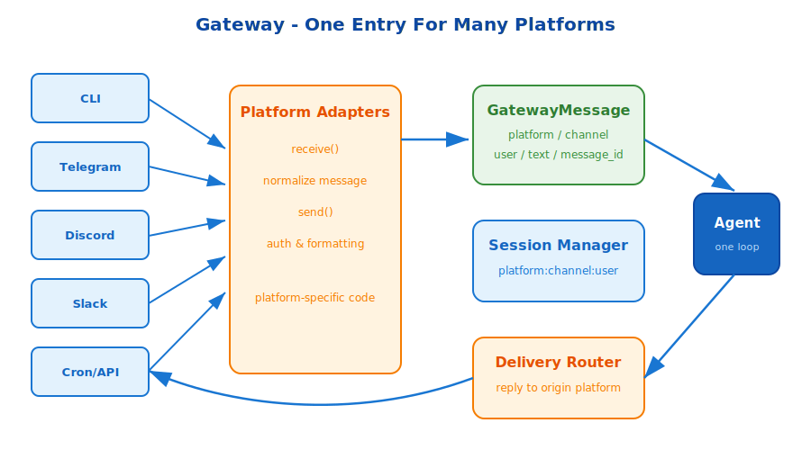

# s14: Gateway — Multi-Platform Message Routing

[中文](README.md) · [English](README.en.md)

s01 → ... → s13 → `s14` → [s15](../s15_profiles/) → ... → s18
> *"One gateway connects every platform"* — platform adapters + normalized messages + delivery routing + session management.
>
> **Hermes Feature**: Gateway — a unified entry point for CLI, Telegram, Discord, Slack, cron, and API traffic.

---

## Problem

After s13, scheduled jobs can run. But where should the result go? A user may be on Telegram, Discord, Slack, a CLI session, or an HTTP API.

Every platform has different authentication, message IDs, formatting, and delivery rules. Without a gateway, the agent would need platform-specific logic everywhere.

---

## Solution



Gateway has three layers:

1. **Platform adapters** implement `send()` and `receive()` for each platform.
2. **Message normalization** turns platform-specific events into one `GatewayMessage` shape.
3. **Delivery routing** sends agent responses back to the correct platform, channel, and message thread.

The agent receives a stable message format and does not need to know whether a request came from CLI, Telegram, Discord, Slack, cron, or HTTP.

---

## Core Mechanisms

### Platform Adapters

Adapters isolate platform-specific behavior: auth, formatting, polling, websockets, and reply semantics.

### Session Management

Gateway keys sessions by platform/channel/user so conversations remain separate and resumable.

### Dynamic Context Injection

Each message can inject platform context such as platform name, channel, user, and message ID. The model knows where it is operating without the core loop changing.

---

## Try It

```sh
python s14_gateway/gateway.py
```

Send sample messages through multiple adapters and observe how they normalize into `GatewayMessage`, create sessions, and route responses back.

---

## What The Teaching Version Simplifies

- Production adapters handle real authentication and network protocols.
- Production sessions persist across process restarts.
- Production delivery can include retries, encryption, and platform-specific formatting.
- Production gateway also owns background services such as the cron ticker.

<!-- translation-sync: en@v1 -->
