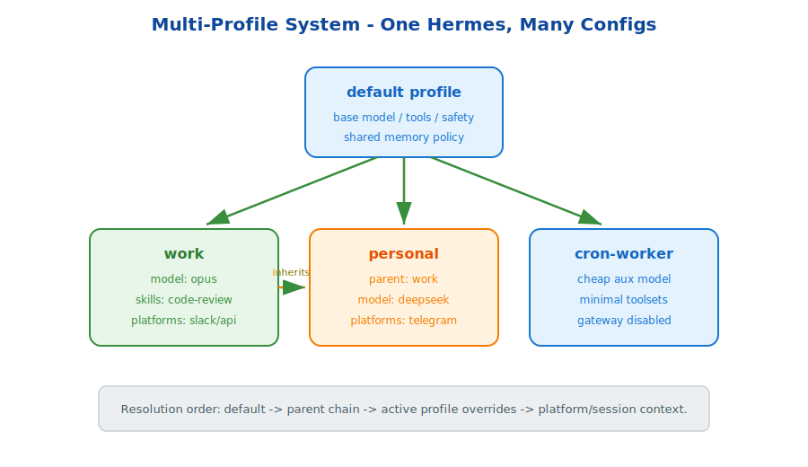

# s15: Multi-Profile System — One Codebase, Many Configurations

[中文](README.md) · [English](README.en.md)

s01 → ... → s14 → `s15` → [s16](../s16_agent_teams/) → ... → s18
> *"One Hermes, many personas"* — isolate models, skills, platforms, permissions, and prompts through profile inheritance.
>
> **Hermes Feature**: Profiles — the same agent runtime can switch behavior by scenario.

---

## Problem

A Hermes instance may serve multiple scenarios:

- Work: company model, code review skills, Slack and API platforms.
- Personal: cheaper model, home automation skills, Telegram.
- Cron worker: lightweight model, minimal tools, no clarification prompts.

If everything is global configuration, switching scenarios is tedious and dangerous.

---

## Solution



A profile is an isolated configuration unit. It can override the global model, system prompt, enabled skills, disabled toolsets, platform bindings, gateway behavior, and parent profile.

Profiles support inheritance. A `personal` profile can inherit from `work`, then override model and platform while preserving shared safety rules.

---

## Core Mechanisms

### Config Isolation

Each profile owns its model, skills, toolsets, platform bindings, and prompt fragments.

### Parent Chain

Resolution order is: defaults → parent profiles → active profile overrides → platform/session context.

### Scenario-Specific Gateways

Profiles can bind to different platforms and optionally start their own gateway behavior.

---

## Try It

```sh
python s15_profiles/profiles.py
```

Create work, personal, and cron-worker profiles. Inspect how inheritance and overrides produce different effective configs.

---

## What The Teaching Version Simplifies

- Production profiles integrate with CLI config files and service startup.
- Production can bind profile selection to platform/channel identity.
- Production must validate toolset compatibility and model availability.
- Production profile changes may trigger gateway or background service restarts.

<!-- translation-sync: en@v1 -->
