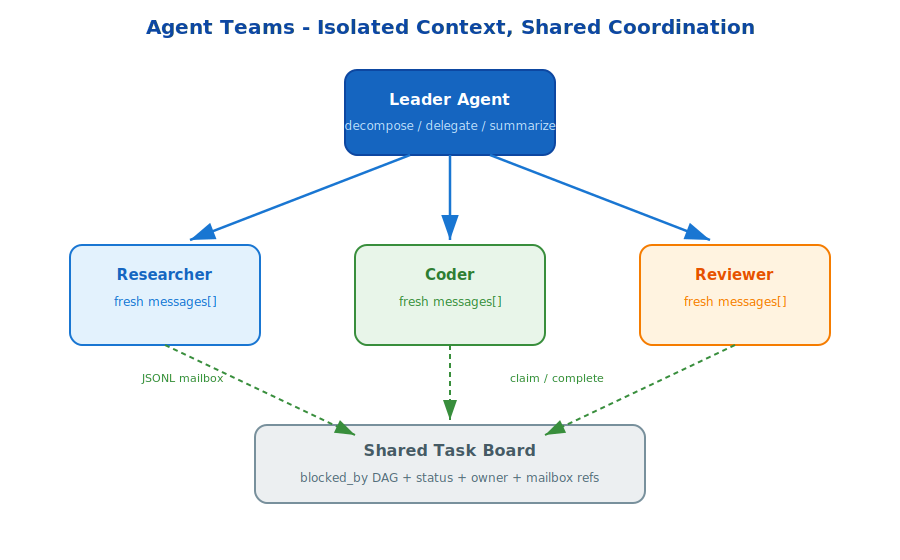

# s16: Agent Teams — When One Agent Is Not Enough

[中文](README.md) · [English](README.en.md)

s01 → ... → s15 → `s16` → [s17](../s17_mcp_plugin/) → s18
> *"Split large work; give each sub-agent a clean context"* — sub-agent spawning + JSONL mailbox + shared task board.
>
> **Hermes Feature**: Agent Teams — multi-agent collaboration with context isolation.

---

## Problem

A single agent hits two limits on large tasks:

1. **Context window pressure**: every subtask competes for the same message list.
2. **Attention dilution**: one agent must reason about research, implementation, review, and coordination at once.

Large work needs multiple agents, each focused on one role with its own context.

---

## Solution



Agent Teams combine three mechanisms:

1. **Sub-agent spawning**: each worker gets a fresh message history.
2. **JSONL mailbox**: agents exchange structured messages without sharing full context.
3. **Task board**: shared task state tracks ownership, dependencies, and completion.

The leader decomposes work, workers execute in isolation, and results return through mailbox summaries.

---

## Core Mechanisms

### Fresh Context

Researcher, coder, and reviewer do not pollute each other's prompt history.

### Mailbox Protocol

Messages include sender, recipient, type, subject, body, and timestamp. The protocol is simple enough to inspect and replay.

### Task Board

Tasks can be blocked by dependencies. Workers claim only tasks that are ready.

---

## Try It

```sh
python s16_agent_teams/agent_teams.py
```

Create a leader, spawn workers, send mailbox messages, and watch task ownership move across the board.

---

## What The Teaching Version Simplifies

- Production teams may run in separate processes or worktrees.
- Production mailboxes need locking, retries, and conflict handling.
- Production leaders summarize worker results back into the main conversation.
- Production teams may combine with autonomous claiming in later chapters.

<!-- translation-sync: en@v1 -->
