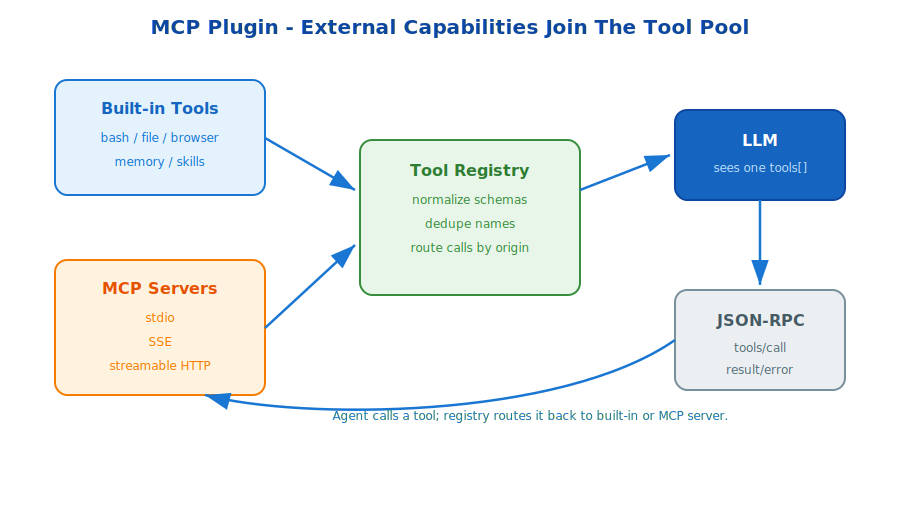

# s17: MCP Plugin — Bring External Capabilities Into The Tool Pool

[中文](README.md) · [English](README.en.md)

s01 → ... → s16 → `s17` → [s18](../s18_full_hermes/)
> *"Need more capabilities? Attach MCP"* — multiple transports + tool routing + unified tool assembly.
>
> **Hermes Feature**: MCP — a standard protocol for external tools.

---

## Problem

Built-in tools are not enough for every domain. Users may need database queries, remote file operations, web search, GitHub, Jira, Slack, or internal APIs.

Writing a custom adapter for every tool creates duplicated protocol code and inconsistent schemas.

---

## Solution



MCP standardizes external tool access. A server exposes tools through a transport such as stdio, SSE, or streamable HTTP. Hermes normalizes those tools into the same `tools[]` array shown to the model.

To the LLM, built-in tools and MCP tools are both callable tools. The registry handles origin, routing, schema cleanup, and result return.

---

## Core Mechanisms

### Transports

- **stdio** for local subprocess tools.
- **SSE** for remote event streams.
- **Streamable HTTP** for cloud-hosted servers.

### Unified Tool Pool

Built-in and MCP tools are merged into one registry and sent to the model as one tool surface.

### JSON-RPC Calls

Tool calls route through JSON-RPC-style requests and responses.

---

## Try It

```sh
python s17_mcp_plugin/mcp_plugin.py
```

Register mock MCP servers, merge their tools into the registry, and route example calls back to the correct server.

---

## What The Teaching Version Simplifies

- Production MCP includes OAuth, connection lifecycle, and resource subscription.
- Production must sanitize schemas and avoid name collisions.
- Production needs timeout handling, retries, and tool output limits.
- Production can load plugins from configured distributions.

<!-- translation-sync: en@v1 -->
