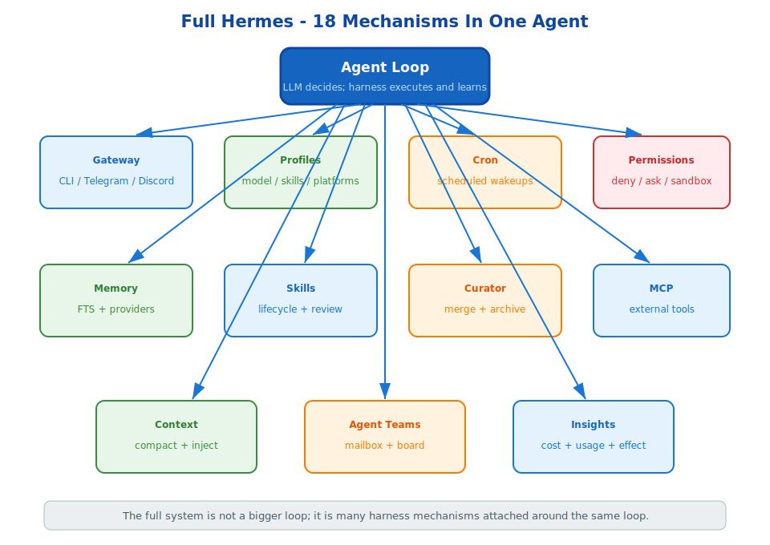

# s18: Full Hermes — A Complete Self-Evolving Agent

[中文](README.md) · [English](README.en.md)

s01 → s02 → ... → s17 → `s18`
> *"18 mechanisms, one complete Hermes"* — from agent loop to multi-platform gateway, all mechanisms return to one runnable system.
>
> **Full Hermes Feature Set**: the first 18 chapters cover Hermes Agent's self-evolution and advanced runtime architecture.

---

## Overview

s01 through s12 build the self-evolution core. s13 through s17 add scheduled wakeups, multi-platform routing, profiles, agent teams, and MCP tool expansion.

s18 integrates them into one complete runtime.

---

## Architecture



The core loop still does not become complicated. Instead, each mechanism attaches around it:

- Gateway handles incoming and outgoing platform messages.
- Profiles select model, skills, platforms, and toolsets.
- Cron wakes the agent at scheduled times.
- Memory and skills inject reusable knowledge.
- Curator maintains long-term skill quality.
- MCP expands the tool pool.
- Agent teams split large tasks into isolated contexts.
- Insights measures usage and self-evolution.

---

## Feature Map

| Chapters | Area | Purpose |
|---|---|---|
| s01-s12 | Self-evolution core | memory, skills, curator, context, insights, recovery |
| s13-s15 | Runtime surfaces | cron, gateway, profiles |
| s16-s17 | Capability expansion | agent teams and MCP tools |
| s18 | Integration | one runnable Hermes-shaped agent |

---

## Try It

```sh
python s18_full_hermes/full_hermes.py
```

Run the integrated demo and inspect how scheduled jobs, platform routing, profile selection, memory, skills, and MCP-style tools fit around the same loop.

---

## What The Teaching Version Simplifies

- Production uses real platform adapters and long-running services.
- Production state is stored in SQLite and service-specific files.
- Production has stronger permissions, hook integration, and config validation.
- Production supports richer MCP, gateway, and profile lifecycle behavior.

<!-- translation-sync: en@v1 -->
