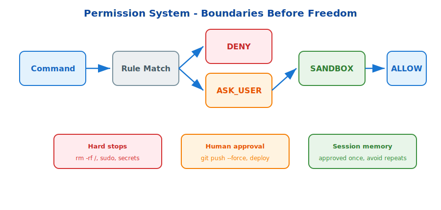

# s19: Permission System — 先划边界，再给自由

[中文](README.md) · [English](README.en.md)

s01 → ... → s18 → `s19` → [s20](../s20_hooks/) → ... → s24
> *"先划边界，再给自由"* — 四层权限检查管线，决定操作能不能做、要不要问用户。
>
> **Harness 基础**: Permission — Agent 安全的第一道防线。

---

## 问题

Agent 有 bash 工具——可以执行任意 shell 命令。如果不加限制，Agent 可能：
- 执行 `rm -rf /`（误删根目录）
- 执行 `sudo` 命令（提权操作）
- 执行 `git push --force`（强制推送覆盖历史）

**需要权限系统——在工具执行前检查操作的安全性。**

---

## 解决方案



四层权限管线，规则按顺序匹配，先匹配先生效：

```
命令 → 规则匹配 → DENY? → 拒绝执行
                    ↓
                ASK_USER? → 弹审批框
                    ↓
                SANDBOX? → 沙箱执行
                    ↓
                ALLOW → 直接执行
```

---

## 核心机制

### 权限级别

| 级别 | 行为 | 适用场景 |
|------|------|---------|
| `DENY` | 硬阻止，不可绕过 | `rm -rf /`, `sudo` |
| `ASK_USER` | 弹窗让用户确认 | `git push --force` |
| `SANDBOX` | 在受限环境中执行 | `curl`, 网络请求 |
| `ALLOW` | 直接执行 | `ls`, `cat`, `git status` |

### 规则优先级

```python
rules = [
    PermissionRule(r"rm\s+-rf\s+/", DENY),      # 先匹配 → 先生效
    PermissionRule(r"sudo", DENY),
    PermissionRule(r"git push --force", ASK_USER),
    PermissionRule(r"ls", ALLOW_ALWAYS),         # 最后匹配
]
```

### Session 记忆

批准过的命令本次 session 不再问——用户不会反复弹窗。

---

## 试一下

```sh
python s19_permission/code.py
```

观察不同命令的权限检查结果。

<details>
<summary>深入 Hermes 源码</summary>

生产版权限系统位于以下源文件:

| 文件 | 职责 |
|------|------|
| `tools/approval.py` | 审批管线、YOLO 模式分类器 |
| `tools/path_security.py` | 文件路径安全检查、沙箱边界 |
| `tools/skills_guard.py` | 技能级别的权限控制 |
| `agent/file_safety.py` | 文件操作安全层、跨 profile 防护 |
| `agent/tool_guardrails.py` | 工具调用前的通用护栏检查 |

教学版简化了什么:
- 生产版有完整的 YOLO 分类器自动判断操作风险等级
- 生产版权限规则支持 glob 模式匹配文件路径
- 生产版 sandbox 模式可以限制网络访问、文件系统范围
- 生产版支持 hardline_blocklist: 即使在 YOLO 模式下也不能绕过的规则

</details>

<!-- translation-sync: zh@v1 -->
