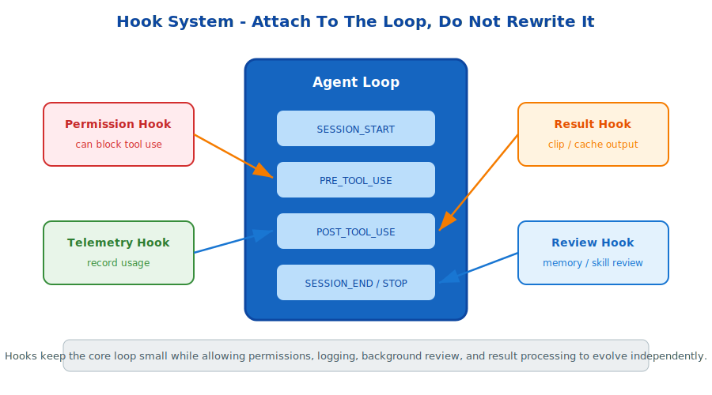

# s20: Hook System — Attach To The Loop, Don't Rewrite It

[中文](README.md) · [English](README.en.md)

s01 → ... → s19 → `s20` → [s21](../s21_worktree/) → ... → s24
> *"Attach to the loop, don't write into the loop"* — PreToolUse, PostToolUse, SessionStart, Stop, and other extension points.
>
> **Harness Foundation**: Hooks — extend behavior without bloating the agent loop.

---

## Problem

Permissions, telemetry, result clipping, background review, and cleanup all need to run at specific points. If every concern is hardcoded into `agent_loop`, the core loop becomes brittle.

The harness needs extension points.

---

## Solution



A hook registry exposes named lifecycle points. Handlers register for those points and receive event context when the loop reaches them.

Pre-tool hooks can block execution. Post-tool hooks can transform or record results. Session hooks can initialize and clean up state.

---

## Core Mechanisms

### Hook Points

Examples include `PRE_TOOL_USE`, `POST_TOOL_USE`, `SESSION_START`, `SESSION_END`, `STOP`, `PRE_COMPACT`, and `POST_COMPACT`.

### Blocking Hooks

A pre-tool handler can return `allow=False`, which is how permission systems naturally fit into hooks.

### Loose Coupling

Features evolve independently while the loop stays small.

---

## Try It

```sh
python s20_hooks/hooks.py
```

Observe safe commands passing, dangerous commands being blocked by hooks, and session statistics being recorded.

---

## What The Teaching Version Simplifies

- Production events carry richer session context and metadata.
- Production supports conditional hooks, such as glob-activated hooks.
- Production hooks can be registered by skills.
- Production stop hooks can be blocking and must handle shutdown carefully.

<!-- translation-sync: en@v1 -->
