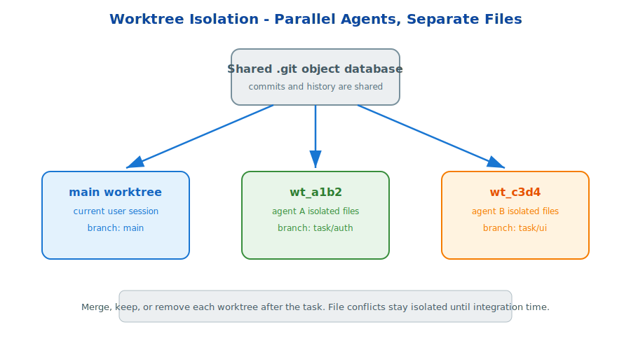

# s21: Worktree Isolation — Separate Directories, No Interference

[中文](README.md) · [English](README.en.md)

s01 → ... → s20 → `s21` → [s22](../s22_planning/) → s23 → s24
> *"Separate directories, no interference"* — git worktrees isolate parallel tasks without copying the repository.
>
> **Harness Foundation**: Worktree — filesystem isolation for parallel agent work.

---

## Problem

When multiple sub-agents edit the same working directory, they can overwrite each other's files. One worker may change `auth.py` while another changes it too.

Parallel work needs filesystem-level isolation.

---

## Solution



Git worktree creates multiple working directories that share one `.git` object database. Each worktree has its own branch and file checkout.

Agents can work independently, then merge, keep, or remove each worktree after the task.

---

## Core Mechanisms

### Separate File Trees

Each agent sees a normal repository directory, but its changes are isolated.

### Shared Git Objects

Worktrees are lightweight because they share commit history and objects.

### Integration Point

Conflicts move to merge time instead of happening during parallel editing.

---

## Try It

```sh
python s21_worktree/worktree.py
```

Create isolated task worktrees and observe how separate branches prevent file interference.

---

## What The Teaching Version Simplifies

- Production uses `git worktree add` and real branch management.
- Production supports configurable base refs.
- Production agents can enter and exit worktrees through tools.
- Production cleanup can keep or remove worktrees depending on task state.

<!-- translation-sync: en@v1 -->
