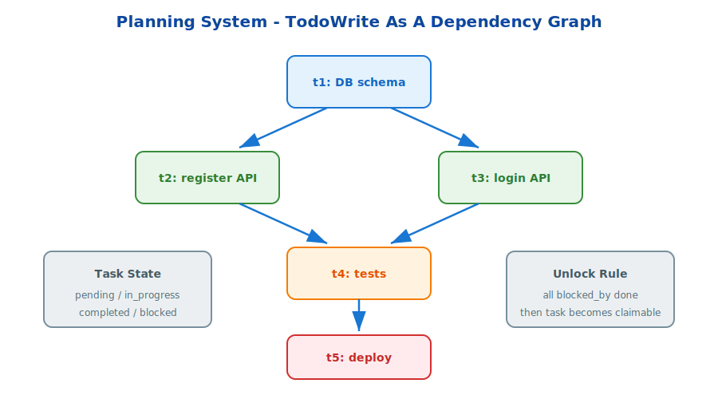

# s22: Planning System — 没计划的 agent 走哪算哪

[中文](README.md) · [English](README.en.md)

s01 → ... → s21 → `s22` → [s23](../s23_autonomous/) → s24
> *"没计划的 agent 走哪算哪"* — 先列计划再执行，任务依赖图 + 状态追踪，完成率翻倍。
>
> **Harness 基础**: TodoWrite — 复杂任务的结构化规划。

---

## 问题

Agent 收到"实现用户认证系统"这种复杂任务时，如果直接开始写代码——容易漏步骤、忘记依赖关系、中途迷失。

**需要先列计划，再逐步执行。**

---

## 解决方案



TodoWrite 工具 + 任务依赖图（DAG）：

```
t1: 设计 DB schema      [⬜] ← 无依赖，先开始
t2: 实现注册接口        [⬜] ← 依赖 t1
t3: 实现登录接口        [⬜] ← 依赖 t1
t4: 写测试              [⬜] ← 依赖 t2, t3（都完成才能开始）
t5: 部署 staging        [⬜] ← 依赖 t4
```

每个任务状态独立追踪，`blocked_by` 字段表达依赖关系。完成任务自动解锁下一个。

---

## 试一下

```sh
python s22_planning/code.py
```

<details>
<summary>深入 Hermes 源码</summary>

生产版任务规划系统位于以下源文件:

| 文件 | 职责 |
|------|------|
| `agent/task_manager.py` | TaskRecord 定义、blockedBy 依赖图、文件持久化 |
| `tools/task_tools.py` | TaskCreate/TaskUpdate/TaskList 工具实现 |

教学版简化了什么:
- 生产版 TaskRecord 包含 blockedBy/blocks 双向依赖和自动状态传播
- 生产版任务文件落盘为 JSON，支持跨 session 和跨 agent 共享
- 生产版 task agent 可以独立运行: 从任务板认领、执行、报告结果
- 生产版 activeForm 字段让进行中的任务显示当前正在做什么

</details>

<!-- translation-sync: zh@v1 -->
