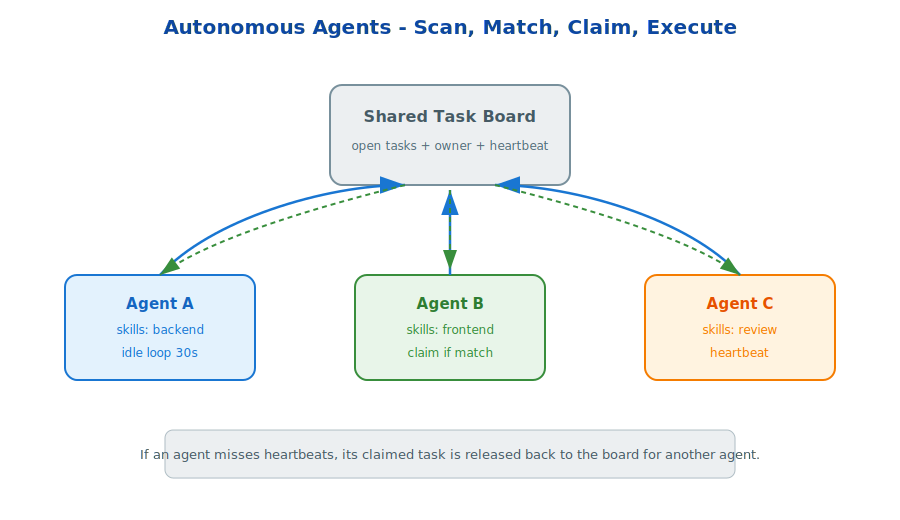

# s23: Kanban Dispatcher — Central Dispatch + Worker Execution

[中文](README.md) · [English](README.en.md)



s01 → ... → s22 → `s23` → [s24](../s24_system_prompt/)
> *"Workers do not scan the board themselves; the Dispatcher assigns work centrally"* — 60s ticks + claim TTL + failure protection.
>
> **Hermes Feature**: Kanban Dispatcher — a persistent multi-agent work queue.

---

## Problem

s16 `delegate_task` is synchronous and non-persistent: when the parent agent's turn ends, the child agents are gone too. Multi-agent collaboration also needs an **asynchronous, persistent** execution model.

---

## Solution

**Kanban Dispatcher** — an event-loop-driven work queue:

```text
         Kanban Board (SQLite)
        ┌──────────────────────┐
        │  todo → ready → running → done
        │              ↓
        │          blocked (failure_limit)
        └──────────────────────┘
                ▲       │
        reclaim │       │ claim + spawn
                │       ▼
        ┌──────────────────────────────┐
        │  Dispatcher (dispatch_once)   │
        │  - ticks every 60 seconds      │
        │  - reclaims stale/crashed work │
        │  - promotes ready tasks        │
        │  - claims + spawns workers     │
        └──────────┬───────────────────┘
                   │ _default_spawn()
                   ▼
        ┌──────────────────────────┐
        │  Worker Process           │
        │  hermes -p <profile>      │
        │  chat -q "work kanban    │
        │  task <id>"              │
        └──────────────────────────┘
```

### Six-Step Dispatch Loop

Each tick (60s) performs:

1. **Reclaim** — release running tasks whose claim TTL expired.
2. **Stale detection** — release running tasks with missing heartbeats.
3. **Crash detection** — detect host-local worker PIDs that have exited.
4. **Promote** — move dependency-satisfied tasks from todo to ready.
5. **Claim + Spawn** — atomically claim a ready task and fork a worker process.
6. **Failure protection** — automatically block after `failure_limit` consecutive failures (default: 2).

### Three Modes Compared

| | delegate_task (s16) | Cron (s13) | Kanban (s23) |
|---|---|---|---|
| Trigger | LLM decision | Scheduled time | Dispatcher event loop |
| Lifecycle | Synchronous, tied to parent turn | Async persistent job | Async persistent task |
| Persistence | None | `jobs.json` | SQLite board |
| Nesting | `max_spawn_depth` | `delegate_task` disabled | `kanban_create` subtasks |

---

## Try It

```sh
python s23_autonomous/autonomous.py
```

---

<details>
<summary>Hermes Source Deep Dive</summary>

The production Kanban system lives in these source files:

| File | Responsibility |
|------|----------------|
| `hermes_cli/kanban_db.py` | Board CRUD, `dispatch_once`, claim/reclaim logic |
| `hermes_cli/kanban.py` | CLI: `kanban create`, `status`, `daemon` |
| `cli.py` (~15486) | `goal_mode` worker loop |
| `agent/conversation_loop.py` (~4476) | `kanban_complete` signal |

What the teaching version simplifies:

- Production embeds the Dispatcher in the gateway process (`dispatch_in_gateway: true`).
- Production workers are real independent processes started through `subprocess.Popen`.
- Production claim logic uses SQLite row locks for atomicity.
- Production supports both `goal_mode` (Ralph-style goal judge loop) and classic worker modes.
- Production isolates work across Board, Tenant, and Profile layers.

</details>

<!-- translation-sync: en@v1 -->
