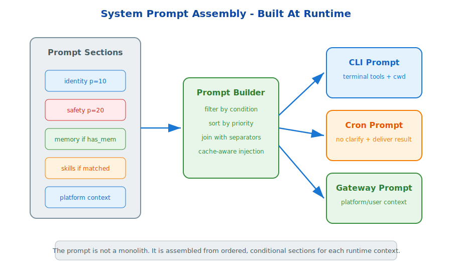

# s24: System Prompt Assembly — Prompts Are Assembled, Not Hardcoded

[中文](README.md) · [English](README.en.md)

s01 → ... → s23 → `s24`
> *"Prompts are assembled, not hardcoded"* — section definitions + conditional injection + priority ordering + platform differences.
>
> **Harness Foundation**: System Prompt — runtime assembly for different contexts.

---

## Problem

A system prompt is often a giant hardcoded string. As soon as you add tools, profiles, memories, platform context, safety rules, or cron-specific behavior, that string becomes difficult to maintain.

The harness needs prompt assembly.

---

## Solution



The prompt is built from ordered sections. Each section has content, priority, and optional conditions. At runtime, the builder filters sections, sorts by priority, and joins them.

The same builder can produce different prompts for CLI, cron, gateway messages, or profile-specific sessions.

---

## Core Mechanisms

### Sections

Examples: identity, safety, memory context, skills, platform context, profile instructions.

### Conditions

Sections are injected only when relevant, such as `has_memories`, `has_skills`, or `platform == cron`.

### Priority

Sections are sorted so foundational identity and safety appear before dynamic context.

---

## Try It

```sh
python s24_system_prompt/system_prompt.py
```

Build prompts for CLI, cron, and gateway contexts. Compare which sections are included and in what order.

---

## What The Teaching Version Simplifies

- Production prompts have many more sections and platform-specific branches.
- Production considers prompt cache behavior when injecting dynamic memory.
- Production integrates profile, gateway, memory, and skill context.
- Production prompt assembly must preserve instruction hierarchy and avoid ambiguity.

<!-- translation-sync: en@v1 -->
